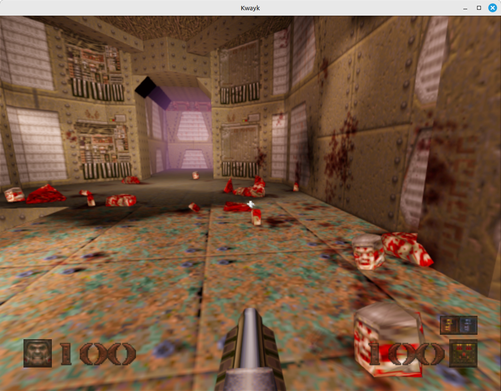

# Kwayk

<p align="center">
  
  
  
</p>

**Kwayk** is a modern reimplementation of the classic Quake (1996) game engine using **Qt Quick 3D** and **QML**. It runs natively on desktop platforms and in web browsers via **WebAssembly**.

## ✨ Features

- 🎮 **Single Player campaign** — monsters, weapons, items, and level progression
- 🌐 **WebAssembly support** — play directly in your browser
- 🎨 **Modern rendering** — Qt Quick 3D with HDR, bloom, ambient occlusion, and dynamic shadows
- 💡 **Color lightmaps** — enhanced lighting (desktop only)
- 🔊 **3D spatial audio** — positional sound using Qt SpatialAudio (desktop) and Web Audio API (WASM)
- ⚡ **Physics engine** — [Qt Quick 3D Jolt Physics](https://github.com/glazunov999/qtquick3djoltphysics) for accurate collision detection
- 🖥️ **Cross-platform** — Linux, Windows, macOS, and WebAssembly
- 📺 **Retro aesthetics** — faithful recreation of the original look and feel

## 🗺️ Roadmap

- [x] Single Player (4 maps ported: Start, E1M1, E1M2, E1M7)
- [ ] Complete Episode 1 (all maps)
- [ ] Episodes 2-4
- [ ] Multiplayer (Deathmatch, Co-op)
- [ ] Custom map support
- [ ] Mod support

## 🖼️ Screenshots



## 🎮 Live Demo

**[▶️ Play in browser (WebAssembly)](https://glazunov999.github.io/)**

## 🚀 Getting Started

### Prerequisites

- **Qt 6.9+** with the following modules:
  - Qt Quick 3D
  - Qt Spatial Audio
  - Qt Multimedia
- **[Qt Quick 3D Jolt Physics](https://github.com/glazunov999/qtquick3djoltphysics)** — physics plugin for Qt Quick 3D
- **CMake 3.16+**

### Building

```bash
# Clone the repository
git clone git@github.com:glazunov999/Kwayk.git
cd Kwayk

# Configure and build
cmake -B build -DCMAKE_PREFIX_PATH=/path/to/Qt/6.9.3/gcc_64
cmake --build build --parallel

# Run
./build/appKwayk
```

### Building for WebAssembly

```bash
# Configure with Emscripten Qt kit
cmake -B build-wasm \
  -DCMAKE_TOOLCHAIN_FILE=/path/to/emsdk/upstream/emscripten/cmake/Modules/Platform/Emscripten.cmake \
  -DCMAKE_PREFIX_PATH=/path/to/Qt/6.9.3/wasm_singlethread

cmake --build build-wasm --parallel

# Serve locally
cd build-wasm
python3 -m http.server 8080
# Open http://localhost:8080/appKwayk.html
```

## 🛠️ Project Structure

```
Kwayk/
├── Assets/           # Game assets (textures, sounds, maps)
│   ├── images/       # UI and texture images
│   ├── maps/         # Level data (converted from BSP)
│   ├── progs/        # Model files (.mdl)
│   └── sounds/       # Sound effects
├── Backend/          # C++ backend modules
│   ├── mdl.*         # Quake MDL model loader
│   ├── cmd.*         # Console command system
│   └── webspatialaudio/  # Web Audio API implementation
├── Kwayk/
│   ├── Core/         # Core game systems (rendering, audio, particles)
│   ├── Game/         # Game logic (entities, triggers, monsters)
│   ├── Ui/           # User interface (menus, HUD, console)
│   └── js/           # JavaScript utilities
└── tools/
    └── q1pak/        # PAK file extractor and BSP converter
```

## 📦 Asset Conversion

Converting Quake assets is a two-step process:

### Step 1: Extract and convert to Collada

The `q1pak` tool extracts PAK files and converts BSP maps to Collada (.dae) format:

```bash
cd tools/q1pak
qmake && make
./q1pak /path/to/id1/pak0.pak -o ./output
```

### Step 2: Convert to Qt Quick 3D format

Use Qt's `balsam` tool to convert Collada files to Qt Quick 3D meshes and QML:

```bash
# Convert a map
balsam ./output/maps/start_map.dae -o ../../Assets/maps/start

# The output includes:
# - meshes/*.mesh    (binary mesh data)
# - *.qml            (Qt Quick 3D scene)
# - maps/*.png       (textures)
```

**Note:** Some manual adjustments to the generated QML may be required for proper material setup.
